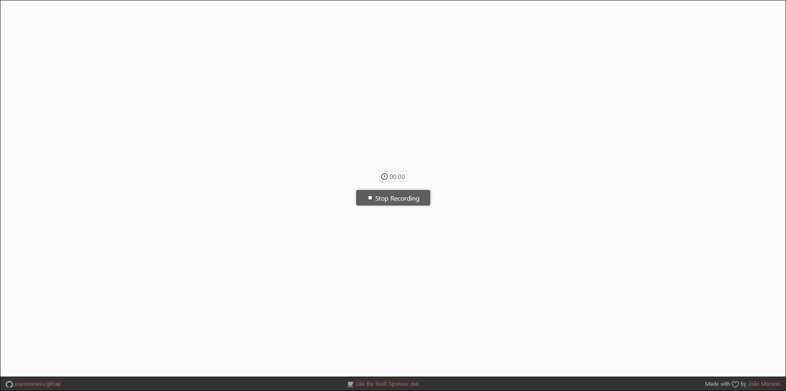
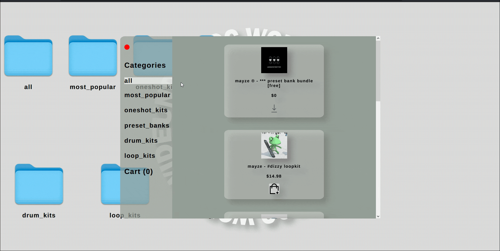
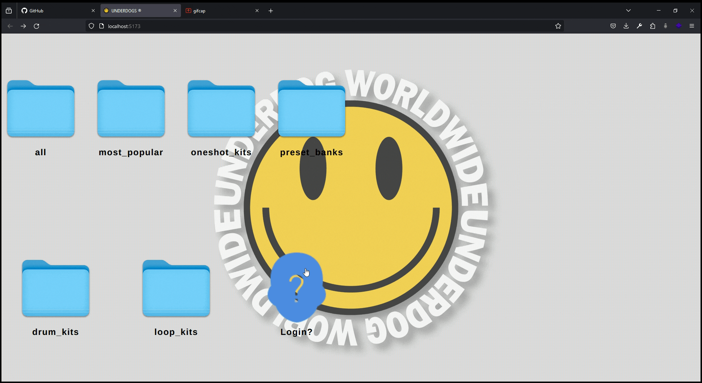

## UnderDogs Version 1.0 Demo

This repository is home to the Version 1.0 of the UnderDogs
e-commerce solution for music producers looking to add certain flavour to their music production. The main objective was
to provide a marketplace solution for a client, using stripe to host the collection of data involved with products, and most importantly, offering a payment gateway solution. I chose to go the route of serverless using Googles Firebase all in one solution for auth, database, storage/retrieval of files and data (products), and out of the box compatability with stripe using extensions.

The initial design request from the owner of the ecommerce store was to be of a desktop computer. File systems were meant to be categories of products, and a finder-esque window would pop up with the 'files' being products. As development went on, I started to become worried about the accessibility and practical use of the website. The owner watched alongside as I pushed my main branch to vercel, and he started to worry as well. In the end, we both came to the conclusion that pursuing the initial design seemed counter-intuitive to what a marketplace should be. It never got finely tuned for production, but...

I greatly enjoyed bringing the idea to life, and host the design [here!!!](https://underdogs-demo-n1dddd.vercel.app/)

## Final Product

### Home Page Moveable File Icons

### Finder Component and Cart Functionality

### Direct Download from Firebase Hosted Storage and Remove from Checkout

### Login Functionality and Stripe Payment Gateway

